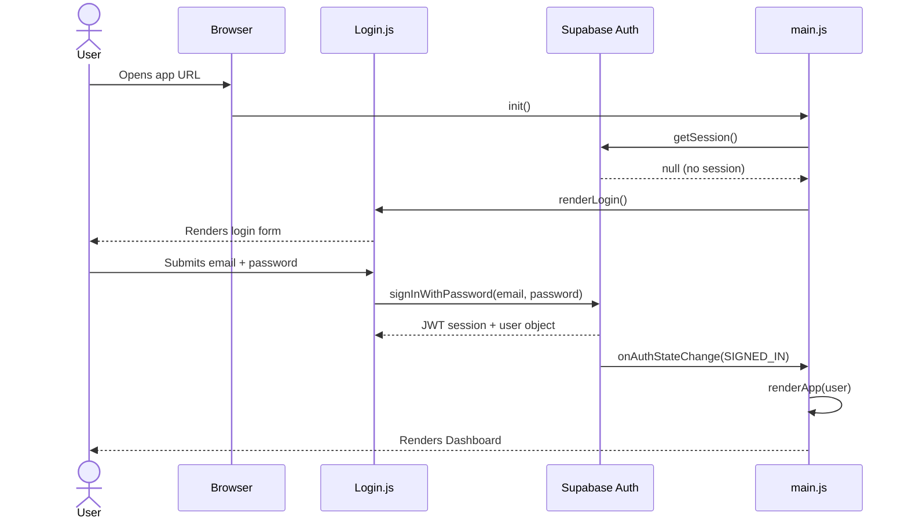
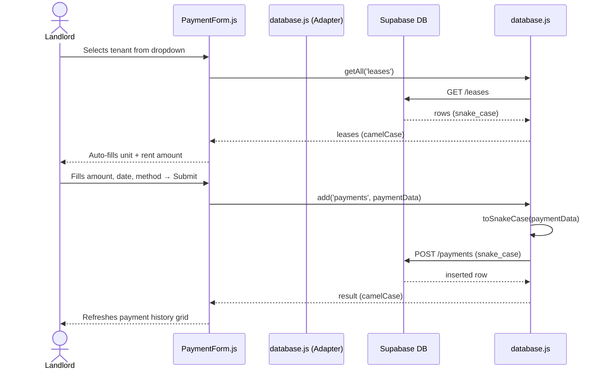
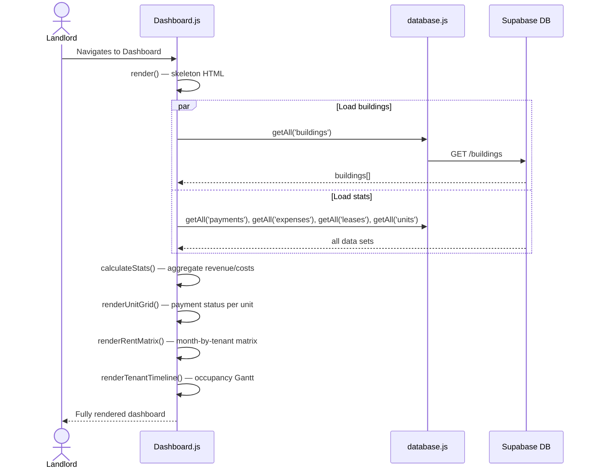
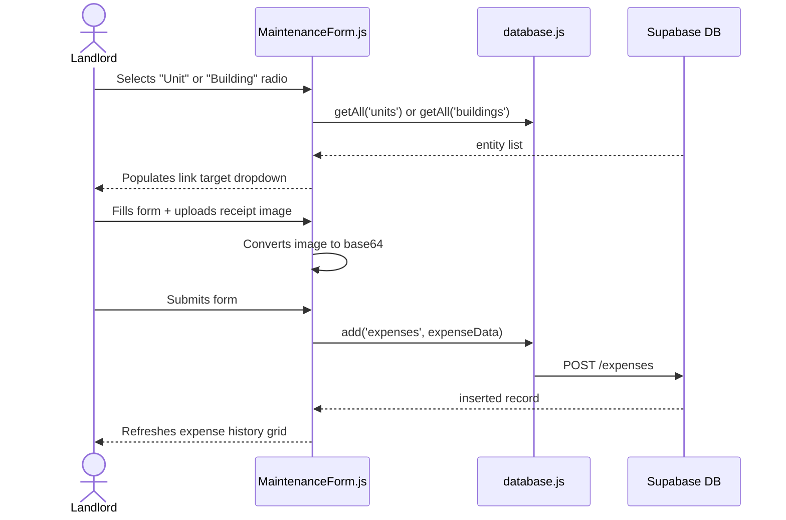

# SmartRent Pro — Product Requirements Document (PRD) & Solution Architecture

**Version:** 1.0  
**Date:** August 2026  
**Status:** Active Development  

---

## Table of Contents
1. [Introduction](#1-introduction)
2. [Goals & Objectives](#2-goals--objectives)
3. [Target Users](#3-target-users)
4. [Functional Requirements (FR)](#4-functional-requirements-fr)
5. [Non-Functional Requirements (NFR)](#5-non-functional-requirements-nfr)
6. [System Architecture](#6-system-architecture)
7. [Data Model](#7-data-model)
8. [Integrations](#8-integrations)
9. [Sequence Diagrams](#9-sequence-diagrams)
10. [User Flows](#10-user-flows)
11. [Deployment Architecture](#11-deployment-architecture)
12. [Security Model](#12-security-model)
13. [Open Items & Future Roadmap](#13-open-items--future-roadmap)

---

## 1. Introduction

**SmartRent Pro** is a lightweight, offline-capable property management application designed for individual Indian landlords and small property management companies. It replaces paper ledgers and spreadsheets with a structured digital system for tracking rental income, maintenance expenses, tenants, and leases across multiple buildings.

The application is accessible as a **Progressive Web App (PWA)** on desktop and as a **native Android app** packaged via Capacitor, allowing landlords to manage their properties from any device.

### 1.1 Problem Statement
Small-scale Indian landlords typically manage rental data in physical notebooks or Excel sheets. This leads to:
- No consolidated view of rent collection status across buildings
- Difficulty tracking overdue payments and partial payments
- No audit trail for maintenance expenses
- Manual month-end reconciliation effort
- No accessibility from mobile devices in the field

### 1.2 Solution
SmartRent Pro provides a cloud-synced, mobile-friendly property management tool with real-time dashboards, automated rent status tracking, and structured expense logging.

---

## 2. Goals & Objectives

| # | Goal | Measurable Objective |
|---|---|---|
| G1 | Centralize property data | All buildings, units, tenants, and leases in one system |
| G2 | Track rent collection | View payment status per unit per month within 2 clicks |
| G3 | Monitor finances | Dashboard showing gross revenue, net profit, and maintenance costs by year |
| G4 | Log maintenance | Record expenses with receipts, vendor info, and status tracking |
| G5 | Multi-device access | Accessible on desktop browser and Android phone |
| G6 | Data security | Only authenticated landlords can access their data |

---

## 3. Target Users

### Primary User: Property Owner / Landlord
- Manages 1–10 residential buildings in India
- Collects rent monthly (calendar or financial year reporting)
- Tracks maintenance and repair costs
- May use the app alone or delegate to a family member
- Comfortable with smartphones; may have limited technical ability

### Secondary User: Property Manager / Agent (Future)
- Manages properties on behalf of owners
- Needs read/write access without full admin permissions

---

## 4. Functional Requirements (FR)

### FR-01: Authentication
| ID | Requirement |
|---|---|
| FR-01.1 | User can register with email and password |
| FR-01.2 | User can log in with email and password |
| FR-01.3 | App maintains session between visits using Supabase JWT |
| FR-01.4 | User can sign out from the navigation bar |
| FR-01.5 | Unauthenticated users are redirected to the login screen |

### FR-02: Building Management
| ID | Requirement |
|---|---|
| FR-02.1 | User can add a building with name and address |
| FR-02.2 | User can edit or delete a building |
| FR-02.3 | User can mark one building as the default dashboard view |
| FR-02.4 | Buildings list is searchable and paginated |

### FR-03: Unit Management
| ID | Requirement |
|---|---|
| FR-03.1 | User can add units linked to a specific building |
| FR-03.2 | Unit has a unit number and status: Vacant, Occupied, or Maintenance |
| FR-03.3 | User can edit or delete units |
| FR-03.4 | Unit status is displayed visually in the dashboard grid |

### FR-04: Tenant Management
| ID | Requirement |
|---|---|
| FR-04.1 | User can add a tenant with name, contact number, and email |
| FR-04.2 | User can edit or delete tenant records |
| FR-04.3 | Tenants are listed with search and pagination |

### FR-05: Lease Management
| ID | Requirement |
|---|---|
| FR-05.1 | User can create a lease linking a tenant to a unit with rent amount and date range |
| FR-05.2 | User can edit or delete leases |
| FR-05.3 | Active leases determine which tenants appear in the payment form |
| FR-05.4 | A lease can store a recurring monthly water charge (`water_charge`) that is auto-loaded into payments |

### FR-06: Payment Entry
| ID | Requirement |
|---|---|
| FR-06.1 | User can record a rent payment with: date received, payment period (month/year), tenant, amount, payment method, and notes |
| FR-06.2 | Payment methods: Bank Transfer, Cash, Check, Credit Card, Other |
| FR-06.3 | User can edit or delete payment records |
| FR-06.4 | Lease details (unit number, monthly rent) auto-fill when a tenant is selected |
| FR-06.5 | Incomplete form data is auto-saved as a draft in localStorage |
| FR-06.6 | Payment history is displayed in a searchable, paginated Grid.js table |
| FR-06.7 | A payment can record a separate water charge component (`water`); the lease's water charge is suggested and only persisted when the payment is saved |

### FR-06A: Payment Editor (Unit-Centric)
| ID | Requirement |
|---|---|
| FR-06A.1 | User can select a unit and manage its leases and payments inline in one screen (`payment-editor` view) |
| FR-06A.2 | Water charge auto-loads from the lease into each payment row; unsaved auto-loaded values are visually distinguished (amber) from saved values (green) and empty values (blue) |
| FR-06A.3 | User can add, edit, and delete payments directly within the unit context |
| FR-06A.4 | Payments can be sorted by period (newest/oldest first) |

### FR-06B: Payment Summary
| ID | Requirement |
|---|---|
| FR-06B.1 | User can view a read-only breakdown of received amounts by tenant, unit, and month (`payment-summary` view) |
| FR-06B.2 | Summary can be filtered by payment method and by building |
| FR-06B.3 | Summary can be sorted by month (newest or oldest first) |
| FR-06B.4 | User-generated values are HTML-escaped before rendering |

### FR-07: Maintenance & Expense Tracking
| ID | Requirement |
|---|---|
| FR-07.1 | User can log a maintenance expense with: date, category, linked entity (unit or building), amount, vendor, status, receipt image, and notes |
| FR-07.2 | Categories: Plumbing, Electrical, Painting, Cleaning, Taxes, Staff Salary, General Repairs |
| FR-07.3 | Expense can be linked to a specific unit or to a building (general) |
| FR-07.4 | Status: Pending Quote, Work in Progress, Paid |
| FR-07.5 | Receipt image is stored as base64 in the database |
| FR-07.6 | User can edit or delete expense records |
| FR-07.7 | Incomplete form data is auto-saved as a draft in localStorage |

### FR-08: Dashboard
| ID | Requirement |
|---|---|
| FR-08.1 | Dashboard shows unit payment status grid for the previous month (Paid, Partial, Overdue, Vacant) |
| FR-08.2 | Financial overview shows: Gross Revenue, Bank Transfer total, Other Methods total, Total Maintenance, Net Profit |
| FR-08.3 | User can toggle between Calendar Year and Financial Year (April–March) views |
| FR-08.4 | User can navigate to previous/next years |
| FR-08.5 | User can filter all dashboard data by building |
| FR-08.6 | Rent Payment Matrix shows month-by-month payment status per tenant |
| FR-08.7 | Tenant Occupancy Timeline shows lease start/end dates visually |

---

## 5. Non-Functional Requirements (NFR)

### NFR-01: Performance
| ID | Requirement |
|---|---|
| NFR-01.1 | Initial page load (LCP) under 3 seconds on a 4G mobile connection |
| NFR-01.2 | Dashboard renders within 2 seconds after authentication |
| NFR-01.3 | Grid.js tables render up to 500 records without visible lag |

### NFR-02: Availability & Reliability
| ID | Requirement |
|---|---|
| NFR-02.1 | Web app availability follows Vercel SLA (99.99% uptime) |
| NFR-02.2 | Supabase backend availability follows Supabase SLA |
| NFR-02.3 | Draft data in localStorage survives browser refresh and device sleep |

### NFR-03: Scalability
| ID | Requirement |
|---|---|
| NFR-03.1 | System handles up to 50 buildings, 500 units, 1000 tenants, 10,000 payments per user |
| NFR-03.2 | Supabase's free tier handles expected query volume; upgrade path to Pro is available |

### NFR-04: Security
| ID | Requirement |
|---|---|
| NFR-04.1 | All data access requires a valid Supabase JWT token |
| NFR-04.2 | Row Level Security (RLS) enforced on all Supabase tables |
| NFR-04.3 | No service role keys exposed to the client |
| NFR-04.4 | HTTPS enforced end-to-end (Vercel default, Supabase default) |
| NFR-04.5 | Supabase anon key used only for authenticated sessions |

### NFR-05: Usability
| ID | Requirement |
|---|---|
| NFR-05.1 | Responsive design works on screens from 360px (mobile) to 1440px (desktop) |
| NFR-05.2 | Navigation via hamburger menu on mobile |
| NFR-05.3 | Last-visited view restored on login via localStorage |
| NFR-05.4 | All currency amounts displayed in INR (₹) with 2 decimal places |

### NFR-06: Maintainability
| ID | Requirement |
|---|---|
| NFR-06.1 | All DB schema changes tracked as SQL migration files in `migrations/` |
| NFR-06.2 | DB access abstracted behind adapter in `database.js` to allow backend swap |
| NFR-06.3 | No framework dependencies — plain JS for ease of long-term maintenance |

### NFR-07: Portability
| ID | Requirement |
|---|---|
| NFR-07.1 | Android APK built via Capacitor from the same web codebase |
| NFR-07.2 | `npm run build` produces a deployable `dist/` folder |

---

## 6. System Architecture

### 6.1 High-Level Architecture

```
┌─────────────────────────────────────────────────────────┐
│                      Client Layer                        │
│                                                          │
│   ┌───────────────────┐    ┌──────────────────────────┐ │
│   │  Web Browser SPA  │    │  Android App (Capacitor) │ │
│   │  (Vercel CDN)     │    │  (Native WebView)        │ │
│   └─────────┬─────────┘    └────────────┬─────────────┘ │
└─────────────┼──────────────────────────-┼───────────────┘
              │ HTTPS (REST + Realtime)   │
┌─────────────▼───────────────────────────▼───────────────┐
│                    Supabase Platform                     │
│                                                          │
│   ┌──────────────┐  ┌──────────────┐  ┌──────────────┐  │
│   │  Auth Service│  │  PostgREST   │  │  Storage     │  │
│   │  (JWT)       │  │  (REST API)  │  │  (Files)     │  │
│   └──────────────┘  └──────────────┘  └──────────────┘  │
│                             │                            │
│                   ┌─────────▼─────────┐                 │
│                   │   PostgreSQL DB    │                 │
│                   │   (with RLS)       │                 │
│                   └───────────────────┘                 │
└─────────────────────────────────────────────────────────┘
```

### 6.2 Frontend Component Architecture

```
main.js  (Entry Point + Auth Router)
│
├── Login.js          — Email/password auth form
│
└── [Authenticated App]
    ├── Navbar.js     — Top navigation, user info, sign-out
    │
    ├── Dashboard.js  — Financial overview, unit grid, rent matrix, timeline
    ├── ManageData.js — CRUD for buildings, units, tenants, leases (tabbed)
    ├── PaymentForm.js — Record rent payments, payment history grid
    ├── PaymentEditor.js — Unit-centric lease/payment editor with water charge auto-load
    ├── PaymentSummary.js — Read-only received-amount breakdown by tenant/unit/month
    └── MaintenanceForm.js — Log expenses, expense history grid
         │
         └── database.js (DB Adapter)
              └── Supabase Client
```

### 6.3 Data Flow

```
Component  →  getDB()  →  dbAdapter  →  toSnakeCase()  →  Supabase API  →  PostgreSQL
           ←           ←             ←  toCamelCase()  ←               ←
```

---

## 7. Data Model

### Entity Relationship Diagram

```
buildings
  ├─< units (building_id)
  │     └─< leases (unit_id)
  │           ├── tenants (tenant_id)
  │           └─< payments (lease_id)
  └─< expenses (link_type='building', link_target=building.id)

units
  └─< expenses (link_type='unit', link_target=unit.id)
```

### Table Definitions

#### `buildings`
| Column | Type | Notes |
|---|---|---|
| `id` | UUID / SERIAL | Primary key |
| `name` | TEXT | Building name |
| `address` | TEXT | Full address |
| `show_when_dashboard_is_loaded` | BOOLEAN | Default dashboard selection flag |
| `created_at` | TIMESTAMPTZ | Auto-generated |

#### `units`
| Column | Type | Notes |
|---|---|---|
| `id` | UUID / SERIAL | Primary key |
| `building_id` | FK → buildings | Parent building |
| `unit_number` | TEXT | E.g., "101", "A-2" |
| `status` | TEXT | Vacant / Occupied / Maintenance |
| `created_at` | TIMESTAMPTZ | Auto-generated |

#### `tenants`
| Column | Type | Notes |
|---|---|---|
| `id` | UUID / SERIAL | Primary key |
| `name` | TEXT | Full name |
| `contact` | TEXT | Phone number |
| `email` | TEXT | Email address |
| `created_at` | TIMESTAMPTZ | Auto-generated |

#### `leases`
| Column | Type | Notes |
|---|---|---|
| `id` | UUID / SERIAL | Primary key |
| `unit_id` | FK → units | Leased unit |
| `tenant_id` | FK → tenants | Lessee |
| `rent_amount` | NUMERIC | Monthly rent in INR |
| `water_charge` | NUMERIC | Recurring monthly water charge in INR (default 0); auto-loaded into payments |
| `start_date` | DATE | Lease start |
| `end_date` | DATE | Lease end (nullable = ongoing) |
| `created_at` | TIMESTAMPTZ | Auto-generated |

#### `payments`
| Column | Type | Notes |
|---|---|---|
| `id` | UUID / SERIAL | Primary key |
| `lease_id` | FK → leases | Associated lease |
| `amount` | NUMERIC | Amount received in INR |
| `water` | NUMERIC | Water charge component of the payment in INR (default 0) |
| `type` | TEXT | Bank Transfer / Cash / Check / Credit Card / Other |
| `payment_period` | DATE | First day of billing month (e.g., 2026-01-01) |
| `date` | DATE | Date payment was received |
| `notes` | TEXT | Reference number, comments |
| `created_at` | TIMESTAMPTZ | Auto-generated |

#### `expenses`
| Column | Type | Notes |
|---|---|---|
| `id` | UUID / SERIAL | Primary key |
| `link_type` | TEXT | 'unit' or 'building' |
| `link_target` | TEXT/INT | FK to unit.id or building.id |
| `category` | TEXT | Plumbing / Electrical / Painting / Cleaning / Taxes / Staff Salary / General |
| `amount` | NUMERIC | Expense amount in INR |
| `vendor` | TEXT | Vendor name / contact |
| `status` | TEXT | Pending Quote / Work in Progress / Paid |
| `receipt_image` | TEXT | Base64 encoded image |
| `notes` | TEXT | Description of work |
| `date` | DATE | Expense date |
| `created_at` | TIMESTAMPTZ | Auto-generated |

---

## 8. Integrations

### 8.1 Supabase
| Aspect | Details |
|---|---|
| **Purpose** | Authentication, database, REST API |
| **Auth** | `supabase.auth.signInWithPassword()`, `signUp()`, `signOut()`, `onAuthStateChange()` |
| **API** | PostgREST auto-generated from PostgreSQL schema |
| **Client** | `@supabase/supabase-js` v2 |
| **Config** | `VITE_SUPABASE_URL`, `VITE_SUPABASE_ANON_KEY` via `.env` |
| **RLS** | Row Level Security enabled; policies enforce per-user data isolation |

### 8.2 Vercel
| Aspect | Details |
|---|---|
| **Purpose** | Web hosting and CDN |
| **Config** | `vercel.json` with SPA rewrite rule (all routes → `index.html`) |
| **Build** | `npm run build` → `dist/` directory |
| **Deploy** | Git-push triggered deployment via Vercel dashboard |

### 8.3 Capacitor (Android)
| Aspect | Details |
|---|---|
| **Purpose** | Native Android packaging |
| **App ID** | `com.smartrent.pro` |
| **App Name** | SmartRentPro |
| **Web Dir** | `dist/` |
| **Sync** | `npx cap sync android` after `npm run build` |
| **Build** | Android Studio or `./gradlew assembleDebug` |

### 8.4 Grid.js
| Aspect | Details |
|---|---|
| **Purpose** | Client-side sortable, searchable, paginated data tables |
| **Used in** | PaymentForm, MaintenanceForm, ManageData |
| **Version** | `gridjs` v6 |
| **Theme** | `gridjs/dist/theme/mermaid.css` |

---

## 9. Sequence Diagrams

### 9.1 User Login Flow



### 9.2 Record Rent Payment Flow



### 9.3 Dashboard Load Flow



### 9.4 Maintenance Expense Logging



---

## 10. User Flows

### 10.1 Onboarding a New Property
1. Sign up / Log in
2. Navigate to **Manage Data → Buildings** → Add building
3. Navigate to **Manage Data → Units** → Add units linked to building
4. Navigate to **Manage Data → Tenants** → Add tenant details
5. Navigate to **Manage Data → Leases** → Create lease linking tenant ↔ unit with rent amount and dates

### 10.2 Monthly Rent Collection Cycle
1. Log in on rent due date
2. Navigate to **Payment Entry**
3. Select tenant → verify auto-filled unit and rent amount
4. Enter amount received, payment method, and date
5. Submit → record appears in Payment History grid
6. Repeat for all tenants
7. Navigate to **Dashboard** to verify all units show "Paid" status

### 10.3 Logging a Maintenance Expense
1. Navigate to **Maintenance**
2. Select category (e.g., Plumbing)
3. Choose link type: Specific Unit or General Building
4. Enter amount, vendor, and status
5. Upload receipt photo (optional)
6. Submit → appears in Expense History grid
7. Dashboard Net Profit updates to reflect the deduction

---

## 11. Deployment Architecture

### 11.1 Web (Production)

```
Developer's Machine
       │
       │  git push
       ▼
  GitHub Repository
       │
       │  Webhook trigger
       ▼
  Vercel Build Pipeline
  ├── npm install
  ├── npm run build  (Vite → dist/)
  └── Deploy to Vercel Edge Network (CDN)
           │
           │  HTTPS
           ▼
     End User Browser
```

### 11.2 Android

```
Developer's Machine
├── npm run build           → dist/
├── npx cap sync android    → copies dist/ to Android project
└── Android Studio
    └── Build APK / AAB
            │
            ▼
      Google Play Store  (future)
      or Direct APK install
```

### 11.3 Environment Configuration

| Environment | URL | Supabase Project |
|---|---|---|
| Development | `http://localhost:5173` | Dev Supabase project |
| Production | Vercel domain | Prod Supabase project |

---

## 12. Security Model

### 12.1 Authentication
- Supabase Auth handles all authentication via signed JWT tokens
- Tokens are stored in browser localStorage by the Supabase client
- Token refresh is automatic via `onAuthStateChange()`

### 12.2 Authorization
- All Supabase tables have Row Level Security (RLS) enabled
- Policies should restrict data access to the authenticated user's own records
- Example RLS policy pattern:
  ```sql
  CREATE POLICY "Users can only see their own buildings"
    ON buildings FOR ALL
    USING (auth.uid() = user_id);
  ```

### 12.3 Client-Side Security
- `VITE_SUPABASE_ANON_KEY` is a public key — safe to expose
- Supabase service role key must never appear in frontend code
- Receipt images are stored as base64 strings in the DB (not public URLs)

### 12.4 OWASP Considerations
| Risk | Mitigation |
|---|---|
| Injection | PostgREST parameterizes all queries; adapter never builds raw SQL |
| Broken Auth | Supabase Auth + RLS; session validated server-side |
| Sensitive Data | HTTPS everywhere; no PII in localStorage (drafts store form field values only) |
| XSS | User content rendered via `innerHTML` should be reviewed; Grid.js uses `html()` helper safely |
| CSRF | Supabase SDK uses Authorization header (not cookies), immune to CSRF |

---

## 13. Open Items & Future Roadmap

### Known Limitations (Current)
- Receipt images stored as base64 in PostgreSQL — inefficient for large files; should migrate to Supabase Storage
- No multi-user / role-based access (single landlord account per app instance)
- No email/SMS rent reminders to tenants
- No PDF report generation / export
- RLS policies need to be fully implemented and tested in Supabase dashboard
- `user_id` foreign key not yet present in all tables for proper RLS enforcement

### Roadmap (Prioritised)
| Priority | Feature |
|---|---|
| P0 | Implement and verify RLS policies with `user_id` on all tables |
| P0 | Migrate receipt images to Supabase Storage (file URLs instead of base64) |
| P1 | PDF export: rent receipts and monthly income statements |
| P1 | Automated overdue rent notifications (email via Supabase Edge Functions) |
| P2 | Multi-user support with owner/manager roles |
| P2 | Tenant portal — tenants can view their payment history |
| P3 | Bulk payment import from CSV / bank statement |
| P3 | Google Play Store publication |
| P3 | iOS app via Capacitor |
